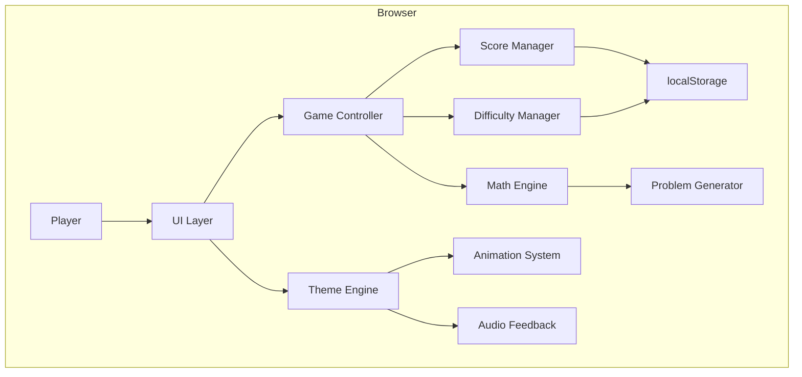
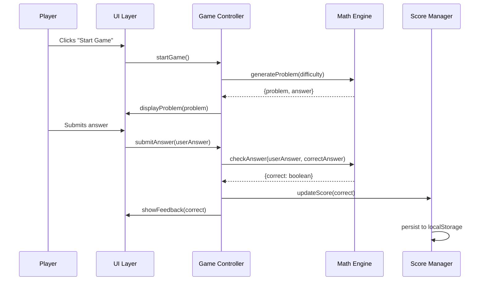

# Architecture: Gorilla Tag Math Game

## System Overview

A web-based educational math game themed around the popular VR game "Gorilla Tag". Players solve arithmetic problems while engaging with jungle-themed visuals and gorilla characters. The game features progressive difficulty, score tracking, and celebratory feedback mechanics. Built as a static web application with no backend dependencies, it can be deployed anywhere and stores progress locally in the browser.

**Key Goals:**
- Engaging math practice for children (ages 6-12)
- Gorilla Tag-inspired aesthetics (jungle, vines, gorilla character)
- Adaptive difficulty based on performance
- Zero server dependencies - fully client-side

## Technology Stack

- **Language**: JavaScript (ES6+), HTML5, CSS3
- **Framework**: Vanilla JavaScript (no framework dependencies)
- **Database**: localStorage for persistence (scores, progress, settings)
- **Build System**: None required (static files) - optional bundler for production
- **Testing**: Jest for unit tests on math engine logic
- **Assets**: Custom CSS animations, emoji/SVG gorilla graphics (avoiding trademarked assets)
- **Deployment**: Any static file host (GitHub Pages, Netlify, etc.)

## System Architecture

The application follows a **Modular MVC-inspired** pattern optimized for a single-page game:

- **Model**: Math engine (problem generation, difficulty scaling, scoring logic)
- **View**: DOM-based UI with CSS animations for feedback
- **Controller**: Game state manager coordinating user input, math engine, and UI updates

All modules are loosely coupled through a simple event/callback system to allow independent testing and modification.

### Component Diagram (Mermaid)



### Data Flow



## File Structure

```
gorilla-tag-math-game/
├── index.html              # Main entry point
├── css/
│   ├── main.css            # Core layout and typography
│   ├── theme.css           # Gorilla Tag jungle theme styling
│   └── animations.css      # Celebration/feedback animations
├── js/
│   ├── app.js              # Application bootstrap & initialization
│   ├── game-controller.js  # Main game state machine
│   ├── math-engine.js      # Problem generation & validation
│   ├── difficulty-manager.js # Adaptive difficulty logic
│   ├── score-manager.js    # Score tracking & persistence
│   ├── ui-controller.js    # DOM manipulation & event handlers
│   └── theme-engine.js     # Animations & audio feedback
├── assets/
│   ├── images/             # SVG gorilla, jungle backgrounds
│   └── audio/              # Sound effects (optional)
├── tests/
│   ├── math-engine.test.js
│   ├── difficulty-manager.test.js
│   └── score-manager.test.js
└── README.md               # Project documentation
```

## Module Specifications

### Module: Math Engine
**Responsibility**: Generate math problems and validate answers
**Key Files**: `js/math-engine.js`
**Dependencies**: None (pure functions)
**Interfaces**:
```javascript
// Generates a new problem based on operation type and difficulty
generateProblem(operation: string, difficulty: number): Problem

// Validates user's answer against correct answer
checkAnswer(userAnswer: number, correctAnswer: number): boolean

// Problem interface
interface Problem {
  operand1: number;
  operand2: number;
  operation: '+' | '-' | '*' | '/';
  displayText: string;
  correctAnswer: number;
}
```

### Module: Difficulty Manager
**Responsibility**: Track performance and adjust difficulty dynamically
**Key Files**: `js/difficulty-manager.js`
**Dependencies**: localStorage (via Score Manager)
**Interfaces**:
```javascript
// Returns current difficulty level (1-3)
getCurrentDifficulty(): number

// Updates difficulty based on recent performance
adjustDifficulty(correctStreak: number, incorrectStreak: number): void

// Gets allowed operations for current difficulty
getAllowedOperations(): string[]

// Difficulty levels:
// 1 = Easy: single digit +/-
// 2 = Medium: double digit +/-, single digit *
// 3 = Hard: all operations, larger numbers
```

### Module: Score Manager
**Responsibility**: Track scores, streaks, and persist to localStorage
**Key Files**: `js/score-manager.js`
**Dependencies**: localStorage API
**Interfaces**:
```javascript
// Updates score after answer
updateScore(correct: boolean): ScoreState

// Gets current score state
getScore(): ScoreState

// Resets current game score
resetGame(): void

// Persists high score
saveHighScore(): void

// ScoreState interface
interface ScoreState {
  current: number;
  streak: number;
  highScore: number;
  totalCorrect: number;
  totalAttempted: number;
}
```

### Module: Game Controller
**Responsibility**: Orchestrate game flow and state transitions
**Key Files**: `js/game-controller.js`
**Dependencies**: MathEngine, DifficultyManager, ScoreManager, UIController
**Interfaces**:
```javascript
// Initializes and starts a new game
startGame(): void

// Handles answer submission
submitAnswer(answer: number): void

// Generates and displays next problem
nextProblem(): void

// Ends game and shows final score
endGame(): void

// Game states: 'menu' | 'playing' | 'feedback' | 'gameover'
```

### Module: UI Controller
**Responsibility**: Manage DOM updates and user input
**Key Files**: `js/ui-controller.js`
**Dependencies**: ThemeEngine
**Interfaces**:
```javascript
// Updates problem display
displayProblem(problem: Problem): void

// Shows correct/incorrect feedback
showFeedback(correct: boolean): void

// Updates score display
updateScoreDisplay(score: ScoreState): void

// Shows/hides game screens
showScreen(screen: 'menu' | 'game' | 'gameover'): void

// Gets answer from input field
getAnswerInput(): number
```

### Module: Theme Engine
**Responsibility**: Handle visual theme, animations, and audio
**Key Files**: `js/theme-engine.js`, `css/theme.css`, `css/animations.css`
**Dependencies**: CSS Animation API, Audio API (optional)
**Interfaces**:
```javascript
// Plays celebration animation (gorilla jumping, vines swinging)
playCelebration(): void

// Plays encouragement animation (try again)
playEncouragement(): void

// Updates background based on score/streak
updateBackground(streak: number): void

// Plays sound effect (optional, respects user preference)
playSound(type: 'correct' | 'incorrect' | 'levelup'): void
```

## Data Models

### localStorage Schema

```javascript
// Key: 'gorillaTagMath_playerData'
interface PlayerData {
  highScore: number;
  totalGamesPlayed: number;
  totalProblemsAttempted: number;
  totalCorrectAnswers: number;
  lastDifficulty: number;
  soundEnabled: boolean;
  lastPlayed: string; // ISO date
}
```

### Problem Model

```javascript
interface Problem {
  id: string;           // Unique identifier
  operand1: number;     // First number
  operand2: number;     // Second number
  operation: string;    // '+', '-', '*', '/'
  displayText: string;  // "5 + 3 = ?"
  correctAnswer: number;
  difficulty: number;   // 1, 2, or 3
}
```

### Game State Model

```javascript
interface GameState {
  status: 'menu' | 'playing' | 'feedback' | 'gameover';
  currentProblem: Problem | null;
  score: number;
  streak: number;
  difficulty: number;
  problemsThisGame: number;
  correctThisGame: number;
}
```

## Implementation Steps

1. **Project Setup**
   - Create directory structure
   - Set up index.html with basic layout
   - Create placeholder CSS files
   - Initialize test environment (Jest)

2. **Math Engine (Core Logic)**
   - Implement `generateProblem()` for each operation
   - Implement `checkAnswer()` validation
   - Add difficulty-based number ranges
   - Write unit tests for all operations

3. **Score Manager**
   - Implement score tracking logic
   - Add streak calculation
   - Implement localStorage persistence
   - Write unit tests

4. **Difficulty Manager**
   - Define difficulty levels and thresholds
   - Implement adaptive algorithm (3 correct = level up, 3 wrong = level down)
   - Write unit tests

5. **UI Controller**
   - Build HTML structure (menu, game, gameover screens)
   - Implement screen transitions
   - Add input handling and validation
   - Create responsive layout

6. **Game Controller**
   - Wire up all modules
   - Implement game loop/state machine
   - Handle edge cases (empty input, invalid numbers)

7. **Theme Engine**
   - Design jungle-themed CSS
   - Create gorilla character (SVG/CSS)
   - Add celebration animations
   - Implement optional audio

8. **Polish & Testing**
   - End-to-end manual testing
   - Cross-browser testing
   - Mobile responsiveness
   - Accessibility audit (keyboard nav, screen readers)

## Testing Strategy

### Unit Tests
- **Math Engine**: Test all operations at all difficulty levels, edge cases (division by zero, negative results)
- **Score Manager**: Test score calculation, streak logic, localStorage read/write
- **Difficulty Manager**: Test level transitions, boundary conditions

### Integration Tests
- **Game Controller**: Test full game flow from start to gameover
- **Persistence**: Test that scores survive page reload

### Manual Testing
- **UI/UX**: Visual appearance, animations, responsiveness
- **Cross-browser**: Chrome, Firefox, Safari, Edge
- **Mobile**: Touch input, screen sizes
- **Accessibility**: Keyboard navigation, color contrast

## Success Criteria

1. **Functional Requirements**
   - [ ] Player can start a new game from menu
   - [ ] Math problems display correctly for all 4 operations
   - [ ] Answer validation works (correct/incorrect feedback)
   - [ ] Score increments on correct answers
   - [ ] Streak tracking works
   - [ ] Difficulty adjusts based on performance
   - [ ] High score persists between sessions
   - [ ] Game over screen shows final score

2. **Non-Functional Requirements**
   - [ ] Page loads in under 2 seconds
   - [ ] No external dependencies (works offline)
   - [ ] Responsive on mobile devices
   - [ ] Accessible via keyboard
   - [ ] No console errors during gameplay

3. **Theme Requirements**
   - [ ] Jungle/forest visual theme
   - [ ] Gorilla character visible
   - [ ] Celebration animation on correct answers
   - [ ] Encouragement on incorrect answers (not punishing)

4. **Code Quality**
   - [ ] All unit tests pass
   - [ ] No hardcoded magic numbers
   - [ ] Consistent code style
   - [ ] Clear module boundaries
