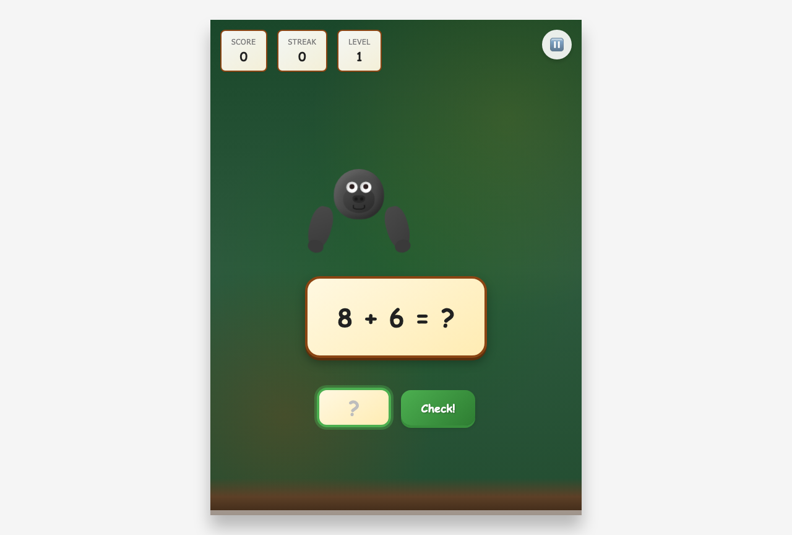

# 🦍 Gorilla Tag Math Game

A fun, educational math game with jungle-themed visuals inspired by the popular VR game Gorilla Tag. Players solve arithmetic problems while engaging with animated gorilla characters and celebratory feedback.


## ✨ Features

- **4 Operations**: Addition, subtraction, multiplication, and division
- **3 Difficulty Levels**: Easy, Medium, and Hard with adaptive difficulty
- **Adaptive Learning**: Difficulty automatically adjusts based on performance
- **Score Tracking**: Points, streaks, and high score persistence
- **Gorilla Theme**: CSS-animated gorilla character with jungle backgrounds
- **Sound Effects**: Optional audio feedback using Web Audio API
- **Responsive Design**: Works on desktop and mobile devices
- **Accessibility**: Keyboard navigation and screen reader support
- **Offline Support**: No server required - runs entirely in the browser

## 🚀 Quick Start

### Playing the Game

1. Open `index.html` in any modern web browser
2. Click "Start Game" to begin
3. Type your answer and press Enter or click "Check!"
4. Complete 20 problems to finish the game

### Installation (for Development)

```bash
# Clone or download the project
cd gorilla-tag-math-game

# Install development dependencies (for testing)
npm install

# Run tests
npm test
```

No build step required - the game runs directly from static files!

## 🎮 How to Play

### Game Flow

1. **Main Menu** - Start the game or adjust settings
2. **Gameplay** - Solve 20 math problems
3. **Feedback** - See if your answer is correct
4. **Game Over** - View your final score and stats

### Difficulty Levels

| Level | Operations | Number Range | Description |
|-------|-----------|--------------|-------------|
| 🟢 Easy | +, - | 1-10 | Single-digit numbers |
| 🟡 Medium | +, -, × | 1-20 | Double-digit numbers |
| 🔴 Hard | +, -, ×, ÷ | 1-50 | All operations |

### Adaptive Difficulty

- **Level Up** ⬆️: 3 correct answers in a row increases difficulty
- **Level Down** ⬇️: 3 incorrect answers in a row decreases difficulty
- Difficulty adjusts automatically during gameplay

### Scoring System

- **Base points**: 10 per correct answer
- **Streak bonus**: +5 points per consecutive correct answer
- **Difficulty multiplier**: Higher levels earn more points

## 📁 Project Structure

```
gorilla-tag-math-game/
├── index.html              # Main game page (entry point)
├── README.md               # This file
├── package.json            # NPM configuration
├── css/
│   ├── main.css            # Core layout and typography
│   ├── theme.css           # Jungle theme styling
│   └── animations.css      # Animations and effects
├── js/
│   ├── app.js              # Application bootstrap
│   ├── game-controller.js  # Game state management
│   ├── math-engine.js      # Problem generation
│   ├── difficulty-manager.js # Adaptive difficulty
│   ├── score-manager.js    # Score and persistence
│   ├── ui-controller.js    # DOM manipulation
│   └── theme-engine.js     # Animations and audio
├── assets/
│   ├── images/             # Game graphics
│   └── audio/              # Sound effects
├── tests/
│   ├── math-engine.test.js
│   ├── difficulty-manager.test.js
│   └── score-manager.test.js
└── docs/
    ├── API.md              # API documentation
    ├── ARCHITECTURE.md     # System architecture
    └── CONTRIBUTING.md     # Contribution guidelines
```

## 🧪 Testing

The project uses Jest for unit testing:

```bash
# Run all tests
npm test

# Run tests in watch mode
npm test -- --watch

# Run specific test file
npm test -- tests/math-engine.test.js
```

### Test Coverage

| Module | Tests | Description |
|--------|-------|-------------|
| Math Engine | ✅ | Problem generation, answer validation |
| Difficulty Manager | ✅ | Level transitions, streak tracking |
| Score Manager | ✅ | Score calculation, localStorage |

## 🌐 Browser Support

| Browser | Version |
|---------|---------|
| Chrome | 60+ |
| Firefox | 55+ |
| Safari | 12+ |
| Edge | 79+ |

## ♿ Accessibility

- Full keyboard navigation (Tab, Enter, Escape)
- ARIA labels for all interactive elements
- Reduced motion support via `prefers-reduced-motion`
- High contrast mode compatible
- Screen reader friendly

## 💾 Data Storage

Player progress is saved in localStorage:
- High score
- Total games played
- Lifetime statistics
- Sound and difficulty preferences

Data is stored under the key `gorillaTagMath_playerData`.

## 🔧 Debug Console

Open browser developer tools (F12) and use:

```javascript
// View current game state
GorillaTagMath.getState()

// View current score
GorillaTagMath.getScore()

// View difficulty info
GorillaTagMath.getDifficulty()

// Reset all data
GorillaTagMath.resetAll()
```

## 🛠️ API Reference

### MathEngine

The core math problem generation module (no dependencies, pure functions):

```javascript
// Generate a new math problem
MathEngine.generateProblem(operation, difficulty);
// Returns: { id, operand1, operand2, operation, displayText, correctAnswer, difficulty }

// Validate an answer
MathEngine.checkAnswer(userAnswer, correctAnswer);
// Returns: boolean

// Get operations available at a difficulty level
MathEngine.getAllowedOperations(difficulty);
// Returns: ['+', '-', '*', '/']
```

### ScoreManager

Score tracking and localStorage persistence:

```javascript
// Update score after answer submission
ScoreManager.updateScore(correct, difficulty);
// Returns: { current, streak, highScore, totalCorrect, totalAttempted, pointsEarned }

// Get current score state
ScoreManager.getScore();
// Returns: { current, streak, highScore, totalCorrect, totalAttempted, accuracy }

// Get lifetime player statistics
ScoreManager.getLifetimeStats();
// Returns: { gamesPlayed, problemsAttempted, correctAnswers, highScore, accuracy }

// Reset game (preserves player data)
ScoreManager.resetGame();

// Clear all saved data
ScoreManager.clearAllData();
```

### DifficultyManager

Adaptive difficulty based on player performance:

```javascript
// Get current difficulty level (1-3)
DifficultyManager.getCurrentDifficulty();

// Record answer results (auto-adjusts difficulty)
DifficultyManager.recordCorrect();
DifficultyManager.recordIncorrect();
// Returns: { levelChanged, newLevel, direction, difficultyName }

// Get difficulty state
DifficultyManager.getState();
// Returns: { difficulty, difficultyName, correctStreak, incorrectStreak, progressToLevelUp }

// Reset difficulty
DifficultyManager.reset(startingDifficulty);
```

### GameController

Main game orchestration and state management:

```javascript
// Initialize with dependencies
GameController.init({ mathEngine, difficultyManager, scoreManager, uiController, themeEngine });

// Game control methods
GameController.startGame();
GameController.submitAnswer(answer);
GameController.pauseGame();
GameController.resumeGame();
GameController.endGame();

// Get current game state
GameController.getState();
// Returns: { status, currentProblem, problemNumber, totalProblems }

// Game states: MENU, PLAYING, FEEDBACK, PAUSED, GAMEOVER
```

## 📖 Documentation

Additional documentation is available in the `docs/` directory:

- [API Documentation](docs/API.md) - Module interfaces and methods
- [Architecture](docs/ARCHITECTURE.md) - System design and patterns
- [Contributing](docs/CONTRIBUTING.md) - How to contribute

## 🎨 Screenshots

| Main Menu | Gameplay | Game Over |
|-----------|----------|-----------|
|  |  |  |

## 📄 License

MIT License - This project is for educational purposes. The game concept is inspired by Gorilla Tag but uses original code and assets.

## 👏 Credits

Built with vanilla HTML, CSS, and JavaScript - no frameworks required!

---

Made with ❤️ for young mathematicians everywhere
